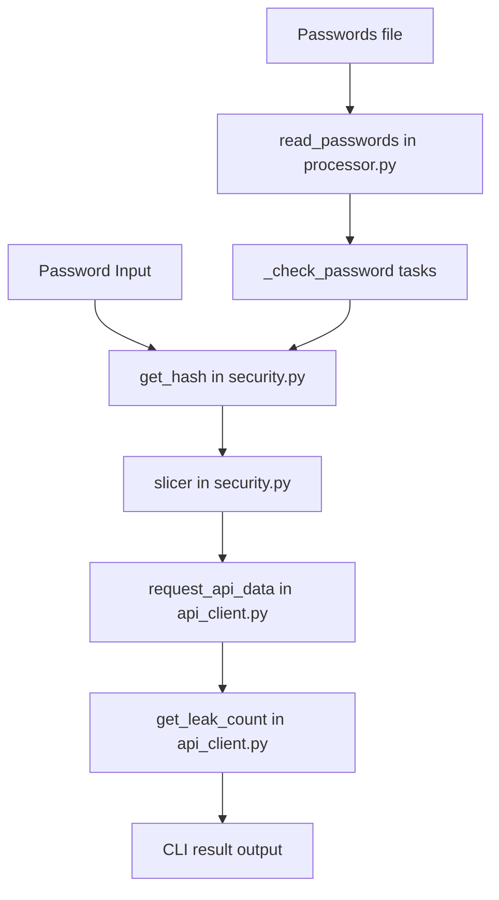

# Password Leak Checker

Python CLI tool to check passwords against the Have I Been Pwned (HIBP) Pwned Passwords API with a privacy-preserving k-anonymity flow and asynchronous bulk processing.

## Privacy & Security Blueprint

This project prioritizes password confidentiality and controlled in-memory handling.

1. **K-Anonymity Principle**
   - `security.get_hash(password)` computes the SHA-1 digest locally.
   - `security.slicer(hash_wert)` splits the digest into a 5-character prefix and suffix.
   - `api_client.request_api_data(request_prefix)` sends only the prefix to `https://api.pwnedpasswords.com/range/{prefix}`.
   - `api_client.get_leak_count(hashes_data, target_suffix)` compares the suffix locally.
   - Result: plaintext passwords and full hashes are never transmitted.

2. **Memory Hygiene via Mutable Buffers**
   - Interactive flow (`pwned_checker.py`) converts input into `bytearray` and wipes it in a `finally` block.
   - File-processing flow (`processor._check_password`) follows the same zeroization pattern.
   - This reduces residual sensitive data in process memory after processing.

## Usage

### 1) Install dependencies

```bash
pip install -r requirements.txt
pip install requests
```

### 2) Interactive mode (single password)

```bash
python pwned_checker.py
```

- Enter a password at the prompt.
- Type `exit` to close the session.

### 3) File mode (bulk check, async)

```bash
python pwned_checker.py /path/to/passwords.txt
```

- Input file: one password per line (UTF-8 text file).
- Empty lines are skipped.

## Architecture & Technical Design

### Runtime Components

- **`pwned_checker.py`**: CLI entry point, mode switch (interactive vs file), async event-loop bootstrap.
- **`processor.py`**: asynchronous file ingestion + in-flight task orchestration for batch checks.
- **`api_client.py`**: HTTP access, retry policy, rate-limiting decorator, suffix leak count lookup.
- **`security.py`**: SHA-1 hashing and prefix/suffix slicing for the k-anonymity protocol.

### Data Flow (Interactive + Batch)



### Async-Pipeline

- `processor.read_passwords(file_path)` uses **`aiofiles`** with `async for` to stream input line-by-line instead of loading the entire file into memory.
- `processor.process_password_file(...)` creates async tasks (`asyncio.create_task`) and keeps a bounded in-flight set (`max_in_flight`, default `20`).
- Completion handling uses `asyncio.wait(..., return_when=asyncio.FIRST_COMPLETED)` to continuously drain finished checks and keep throughput stable.

### Throttling-Engine

`api_client.rate_limited(max_concurrent, requests_per_second)` wraps async API calls with two coordinated controls:

1. **Concurrency Guard**: `asyncio.Semaphore(max_concurrent)` limits simultaneous request execution.
2. **Token Bucket**: `_RateLimitState.acquire_token()` refills tokens over time (`monotonic()` based) and enforces average request rate (`requests_per_second`).

`request_api_data` is decorated with:

```python
@rate_limited(max_concurrent=5, requests_per_second=8)
```

This means requests must pass both the token budget and semaphore gate before dispatch.

### Resilience Layer (Exponential Backoff)

- Retry-enabled statuses: `{429, 500, 502, 503, 504}` (`RETRY_STATUS_CODES` in `api_client.py`).
- Retry delay schedule (`RETRY_DELAYS`): **`[0.5, 1, 2, 5, 20, 60]`** seconds.
- `api_client.request_api_data` applies increasing waits and then continues retries with the maximum delay (`60s`) for subsequent attempts.
- Non-retryable responses return an empty payload to the caller, which is surfaced as an error status in CLI output.

## Operational Notes

- The HTTP call runs via `requests.get(..., timeout=5)` inside `asyncio.to_thread(...)` so network I/O does not block the event loop.
- Batch mode progress is logged every `progress_interval` items (default: `100`).
- Output states in batch mode: `SAFE`, `PWNED`, `ERROR`.
